# Daily Reflection Tree — Visual Diagram

```mermaid
flowchart TD
    START([▶ START\nGood evening...]) --> A1_OPEN

    subgraph AXIS1 ["🔵 AXIS 1 — Locus: Victim ↔ Victor"]
        A1_OPEN["❓ A1_OPEN\nHow would you describe today?"]
        A1_OPEN --> A1_D0

        A1_D0{{"⚙ A1_D0\nAnswer routing"}}
        A1_D0 -->|Productive / Mixed| A1_Q_HIGH
        A1_D0 -->|Tough / Frustrating| A1_Q_LOW

        A1_Q_HIGH["❓ A1_Q_HIGH\nWhen something went well,\nwhat was behind it?"]
        A1_Q_LOW["❓ A1_Q_LOW\nWhen things got hard,\nwhat did you find yourself doing?"]

        A1_Q_HIGH -->|signals: axis1:internal or external| A1_Q2
        A1_Q_LOW  -->|signals: axis1:internal or external| A1_Q2

        A1_Q2["❓ A1_Q2\nWhen you replay today,\nwhich feels most honest?"]
        A1_Q2 -->|signals accumulated| A1_D1

        A1_D1{{"⚙ A1_D1\nSignal-based routing"}}
        A1_D1 -->|axis1: internal dominant| A1_R_INT
        A1_D1 -->|axis1: external dominant| A1_R_EXT

        A1_R_INT[["💭 A1_R_INT\nYou stayed in the driver's seat..."]]
        A1_R_EXT[["💭 A1_R_EXT\nToday pulled your attention outward..."]]
    end

    A1_R_INT --> BRIDGE_1_2
    A1_R_EXT --> BRIDGE_1_2

    BRIDGE_1_2(["↓ BRIDGE 1→2\nNow let's shift — how you showed up\nis one thing. What you gave is another."])
    BRIDGE_1_2 --> A2_OPEN

    subgraph AXIS2 ["🟢 AXIS 2 — Orientation: Entitlement ↔ Contribution"]
        A2_OPEN["❓ A2_OPEN\nThink of one interaction today.\nWhat was on your mind?"]
        A2_OPEN -->|axis2:contribution signal| A2_Q_CONTRIB
        A2_OPEN -->|axis2:entitlement signal| A2_Q_ENTIT

        A2_Q_CONTRIB["❓ A2_Q_CONTRIB\nYou were thinking about\ngiving or delivering..."]
        A2_Q_ENTIT["❓ A2_Q_ENTIT\nYou were tracking recognition\nor fairness..."]

        A2_Q_CONTRIB -->|signals| A2_Q2
        A2_Q_ENTIT  -->|signals| A2_Q2

        A2_Q2["❓ A2_Q2\nWhen you helped someone today,\nwhat was the thought underneath?"]
        A2_Q2 -->|signals accumulated| A2_D1

        A2_D1{{"⚙ A2_D1\nSignal-based routing"}}
        A2_D1 -->|axis2: contribution dominant| A2_R_CONTRIB
        A2_D1 -->|axis2: entitlement dominant| A2_R_ENTIT

        A2_R_CONTRIB[["💭 A2_R_CONTRIB\nYou were thinking about what\nyou could give..."]]
        A2_R_ENTIT[["💭 A2_R_ENTIT\nYou spent energy tracking\nwhat was owed to you..."]]
    end

    A2_R_CONTRIB --> BRIDGE_2_3
    A2_R_ENTIT  --> BRIDGE_2_3

    BRIDGE_2_3(["↓ BRIDGE 2→3\nOne last dimension.\nHow wide was your lens today?"])
    BRIDGE_2_3 --> A3_OPEN

    subgraph AXIS3 ["🟠 AXIS 3 — Radius: Self-Centric ↔ Altrocentric"]
        A3_OPEN["❓ A3_OPEN\nWhose experience matters most\nto you right now?"]
        A3_OPEN -->|axis3:self signal| A3_Q_SELF
        A3_OPEN -->|axis3:altro signal| A3_Q_ALTO

        A3_Q_SELF["❓ A3_Q_SELF\nIs there someone affected\nby what you went through?"]
        A3_Q_ALTO["❓ A3_Q_ALTO\nDid that awareness actually\nchange what you did?"]

        A3_Q_SELF  -->|signals| A3_D1
        A3_Q_ALTO -->|signals| A3_D1

        A3_D1{{"⚙ A3_D1\nSignal-based routing"}}
        A3_D1 -->|axis3: altro dominant| A3_R_ALTO
        A3_D1 -->|axis3: self dominant| A3_R_SELF

        A3_R_ALTO[["💭 A3_R_ALTO\nYou were thinking beyond\nyourself today..."]]
        A3_R_SELF[["💭 A3_R_SELF\nToday, your frame was\nmostly your own..."]]
    end

    A3_R_ALTO --> SUMMARY
    A3_R_SELF --> SUMMARY

    SUMMARY[["📋 SUMMARY\nToday you showed up {axis1_summary}\non agency, {axis2_summary}\non contribution, {axis3_summary}\non radius..."]]
    SUMMARY --> END
    END([⏹ END\nSee you tomorrow.])
```



---

## Node Type Legend

| Symbol | Type | Description |
|--------|------|-------------|
| `▶` rounded | `start` | Opens session — auto-advances |
| `❓` rectangle | `question` | Employee picks from fixed options |
| `⚙` diamond | `decision` | Internal routing — invisible to employee |
| `💭` double-border | `reflection` | Employee reads insight, presses Continue |
| `↓` rounded | `bridge` | Axis transition — auto-advances |
| `📋` double-border | `summary` | End-of-session synthesis |
| `⏹` rounded | `end` | Closes session |

---

## Signal Accumulation Diagram

```
                     [ANSWER]
                        │
          ┌─────────────┴─────────────┐
          │  option.signal = axis1:internal  │  option.signal = axis1:external
          ▼                                  ▼
  state.axis1.internal += 1        state.axis1.external += 1
          │                                  │
          └─────────────┬─────────────┘
                        ▼
                [DECISION NODE]
         if internal > external → A1_R_INT
         if external ≥ internal → A1_R_EXT
```

---

## All Possible Paths (8 unique conversation outcomes)

| Axis 1 | Axis 2 | Axis 3 | Reflections shown |
|--------|--------|--------|-------------------|
| internal | contribution | altro | A1_R_INT → A2_R_CONTRIB → A3_R_ALTO |
| internal | contribution | self | A1_R_INT → A2_R_CONTRIB → A3_R_SELF |
| internal | entitlement | altro | A1_R_INT → A2_R_ENTIT → A3_R_ALTO |
| internal | entitlement | self | A1_R_INT → A2_R_ENTIT → A3_R_SELF |
| external | contribution | altro | A1_R_EXT → A2_R_CONTRIB → A3_R_ALTO |
| external | contribution | self | A1_R_EXT → A2_R_CONTRIB → A3_R_SELF |
| external | entitlement | altro | A1_R_EXT → A2_R_ENTIT → A3_R_ALTO |
| external | entitlement | self | A1_R_EXT → A2_R_ENTIT → A3_R_SELF |

Each of these 8 paths has a unique `summary_reflection` keyed in `reflection-tree.json`.
